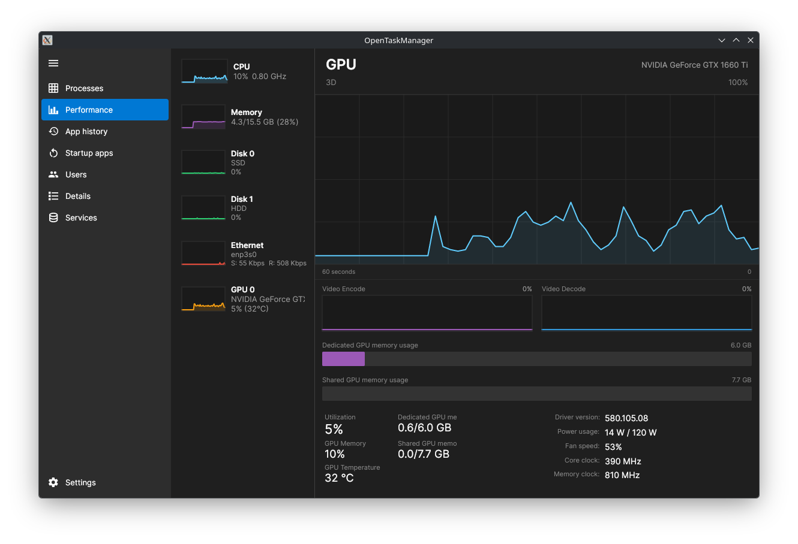
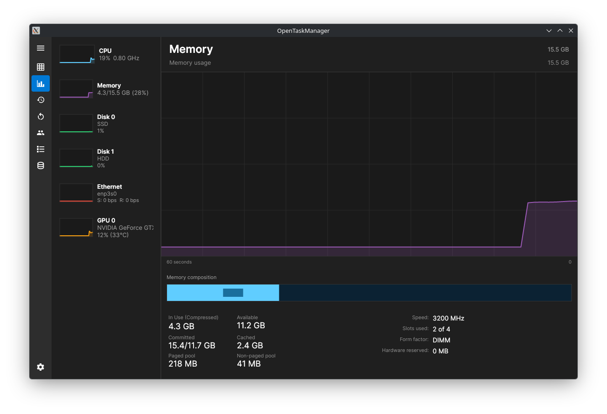
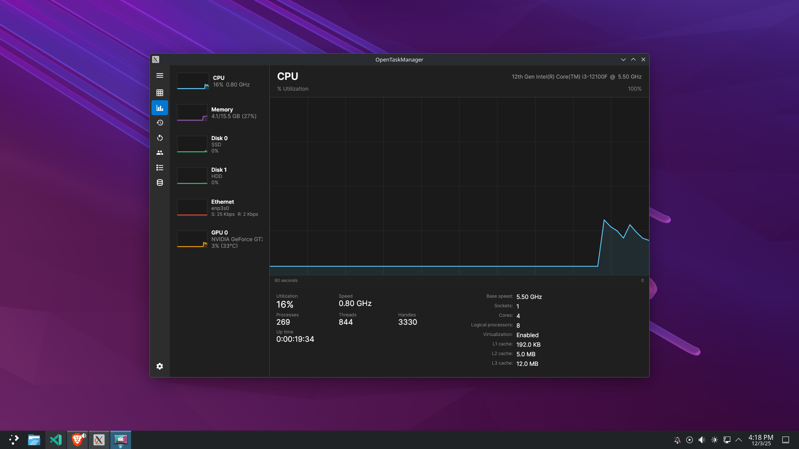

# OpenTaskManager

A modern Task Manager for Linux systems, inspired by the Windows 11 Task Manager.

## Requirements

- .NET 10.0 (SDK)
- Linux (any distribution supported by .NET)

## Installation

1. Clone and build the project:
   ```bash
   git clone https://github.com/Junaid433/OpenTaskManager.git
   cd OpenTaskManager
   dotnet restore
   dotnet build
   sudo dotnet run
   ```

## Screenshots





---

Built with [Avalonia UI](https://avaloniaui.net/)

